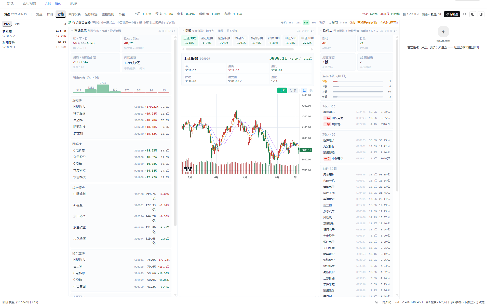
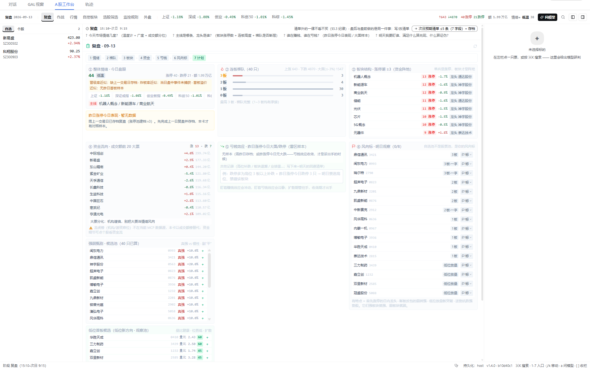
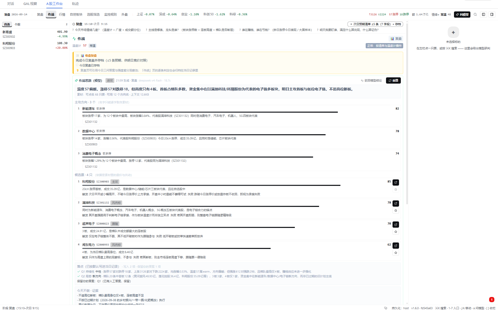
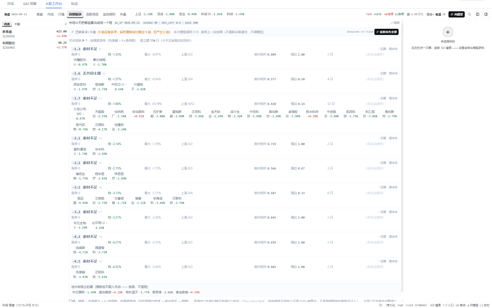
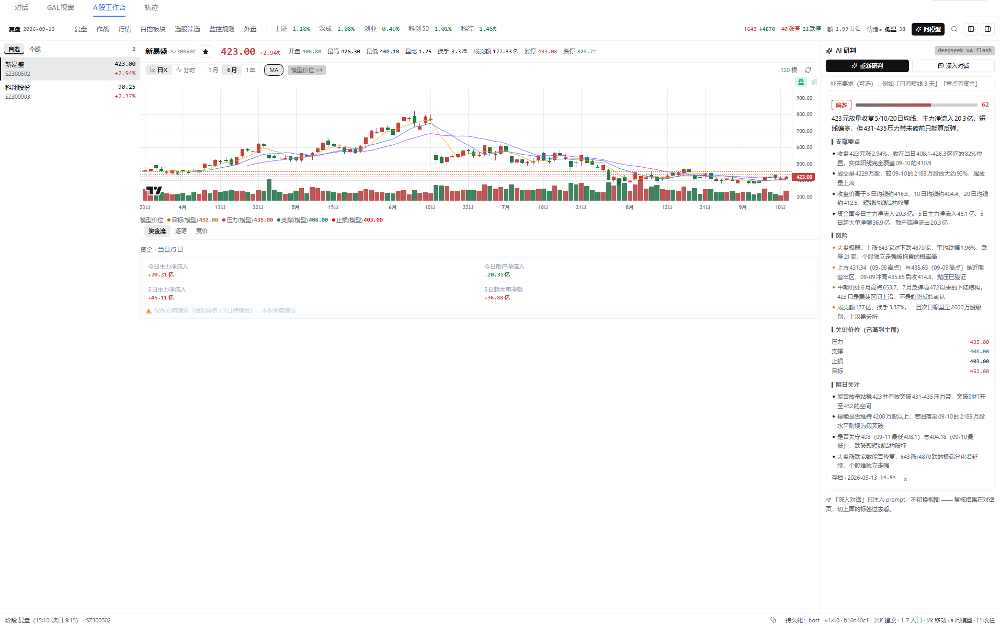
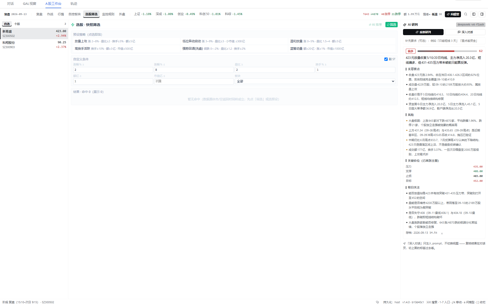
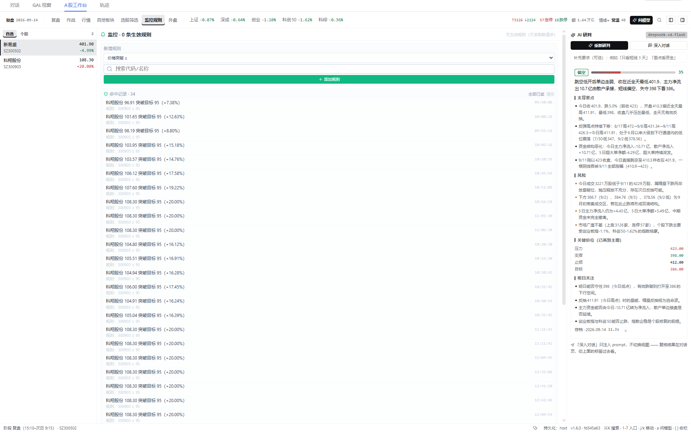
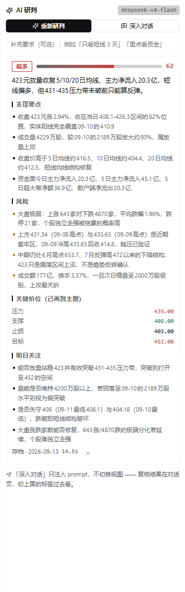

# @lisonevf/dsh-stock-panel

A 股**盯盘执行台** —— DSH Web 插件（挂在官方 `conversation.view` 槽位，会话页「对话」右侧的**「A股工作台」视图标签**）。

> **定位**：盘中/盘后的**执行台**，服务 `WATCH-METHODOLOGY.md` 的固定时间表——盘后复盘写清单 → 次日竞价对照
> → 盘中只答 Q1–Q3 → 尾盘定仓。**不是**全功能量化平台：选股引擎、回测、财务、数据管道属父项目
> `tickflow-stock-panel`；概念命名的算法来源是兄弟项目 `cluster-namer`。边界表见 `docs/ROADMAP.md` §1。

## 界面（实机截图）

截图由 `node acceptance/readme-shots.mjs <dsh web 地址>` 真机采集（headless Chrome + 真行情，只截插件面板区域，
每张图配一行自检日志），产物在 `docs/images/`。重出方法见 §本地开发加载。



**行情**（默认入口）：市场总览 / 指数 / 涨停梯队**并排聚合成一屏**——各占一列、各自内部滚动、整页不滚动，
横向一眼扫完；列数按**容器实测宽度**分档（本图是三列档）。顶部状态带常显阶段、一级导航、涨跌家数、
两市成交额、情绪档位，以及「问模型 / ⌘K / 收栏」。

| 复盘：七步流程 | 作战：竞价 → 验证窗 → 盘中 → 尾盘 |
| --- | --- |
|  |  |
| 盘后走完七步，输出**次日预期清单**（≤5 条 / 7 字段）并存档；列流并排、⑦ 输出独占整行。 | 时段自动切换，手动点过导航则本会话不再跟随；竞价段给「预期 × 竞价」对照矩阵，盘中只答 Q1–Q3。 |

| 自挖板块：共动聚类 + 模型命名 | 工作台：个股（日K⇄分时 + 资金 / 逐笔 / 竞价） |
| --- | --- |
|  |  |
| 无监督共动类 → **批量**问模型命名归类；按强度排序，行内给涨停数/均涨幅；页头显示模型调用预算与缓存命中。 | 点左栏任一行即到（不上导航栏）：报价头 + 日K⇄分时 + 资金/逐笔/竞价 + 右栏 AI。 |

| 选股筛选：快照筛选 + MA 信号 + AI 排序 | 监控规则：规则与命中 |
| --- | --- |
|  |  |
| AI 排序结果带 `AI#n` 徽标，同样只做参考、不覆盖你的草稿。 | 命中由常驻 `AlertWatcher` 推 Toast 与徽标——不占主区，任何入口下都生效。 |

|  | **AI 回填：右栏常驻的决策卡**（上图为特写）<br><br>「一键研判」经 host 半直调官方 `ctx.llm` 拿严格 JSON，归一后回填四处：这张决策卡（立场 / 把握分 / 支撑要点 / 风险）、主图**关键价位线**、复盘预期排序参考区、选股 AI 排序。<br><br>结果永远只读——逐条「+」才写进你的清单，已在清单的条目标注而不重复插入。 |
| --- | --- |

## 安装（add 即现，零额外修改/配置）

```bash
# registry 发布版：
dsh plugin --profile web add @lisonevf/dsh-stock-panel
# 本地开发（在插件仓库目录执行，link: 挂载 → 改源码只需 build + 重启）：
dsh plugin --profile web add .
```

之后**重启 `dsh web`** 并**硬刷新浏览器**（Ctrl+Shift+R）——会话页出现「**A股工作台**」视图标签页。
不需要手工登记 settings、不需要跑脚本、**也不改动宿主任何文件**。
> registry 上 `0.3.5` 及以前是**旧形态**（1.0.0 ~ 1.4.0 从未发过 registry），请装 **1.5.0 及以后**：
> `dsh plugin --profile web add @lisonevf/dsh-stock-panel@1.5.0`。

| 环节 | 机制 |
| --- | --- |
| 加入组合层 | `dsh plugin` 在安装成功后按安装态 reconcile：本包声明 `dsh.bundle.patch` → 自动追加进 profile 的 `dsh.profile.bundles` |
| host 半加载 | 包的 `cordis.patch.yml`（`insert: stock-panel-host`）作为 bundle 层叠加，loader 加载 `lib/index.js` |
| **视图注入** | browser 半（`lib/client.js`）用官方 `ctx.slots.inject('conversation.view', …)` 注册视图条目——声明感知、零宿主改动 |
| browser 半进图 | 本包声明 `dsh.client`（platform: web）+ `exports["./client"]` → 浏览器自动加载 `lib/client.js` |

> ⚠️ **构建产物 ≠ 运行实例**：`lib/` 是构建输出（已 gitignore），浏览器加载的是**上次刷新时**的 bundle；
> host 半是**进程内**加载的，改了代码**必须重启 `dsh web`**。只 build 不重启/不刷新 = 看到的还是旧界面。
> 一条命令判断：`node scripts/verify-live.mjs`（比对运行实例与当前源码的 buildId，不一致会直接告诉你重启）。

## 界面结构

一级导航 = **方法论两阶段 + 各板块平铺**（不再有「工具」中间层）：

```
┌ 状态带：阶段(可点，看本时段该答什么)│[复盘][作战][行情][自挖板块][选股筛选][监控规则][外盘]│指数条│广度│情绪≈│[问模型][⌘K] ┐
├──────────┬──────────────────────────────────────────────┬──────────────────────┤
│ 左栏      │ 主区：一级入口对应的**整页**                    │ 右栏 AI 研判          │
│ 自选      │ · 复盘：七步流程（列流并排，⑦输出独占整行）        │  一键研判 → 决策卡     │
│ 个股      │ · 作战：竞价→验证窗→盘中→尾盘（时段自切）         │  关键价位 → 画到主图   │
│ (最近看过) │ · 行情 / 自挖板块 / 选股筛选 / 监控规则 / 外盘     │  深入对话 → 注入对话   │
│          │ · 工作台（点左栏任一行就到这里，不上导航栏）        │                      │
└──────────┴──────────────────────────────────────────────┴──────────────────────┘
```

| 入口 | 时段 | 你要做的事 |
| --- | --- | --- |
| **复盘** | 15:10–次日 9:15 | 七步复盘 → **写下次日预期清单（≤5 条，7 字段）并存档** |
| **作战** | 9:15–15:00 | 竞价（预期×竞价对照矩阵）→ 验证窗 → 盘中（Q1/Q2/Q3 必答卡）→ 尾盘（兑现/换股/定仓） |
| **行情**（默认） | 任意时段 | 市场总览 + 指数 + 涨停梯队（**一屏并排聚合**，滚到哪块才轮询哪块） |
| **自挖板块** | 任意时段 | 无监督共动聚类 → **模型自动命名归类**；按**强度**（均涨幅 + 6×涨停数）排序 |
| **选股筛选** | 任意时段 | 快照筛选 + MA 信号 + AI 排序 |
| **监控规则** | 任意时段 | 价格/涨跌幅/关键词规则与命中（命中走常驻 Watcher + Toast/徽标） |
| **外盘** | 任意时段 | 港股 / 美股 / 期货（**次要**，排在最后、颜色更淡） |
| **工作台** | 任意时段 | 个股信息：报价头 + 日K⇄分时 + 资金/逐笔/竞价 + 右栏 AI（**不上导航栏**，点股票即到） |

**七条硬约束**（都不是偏好，改了会掉功能）：

- **默认入口 = 行情**（`DEFAULT_VIEW`，单测钉住）：任何时段都成立的第一眼；`1` / `2` 一键到复盘 / 作战，
  未手动点过导航时 9:15 / 15:10 这类边界仍会自动跟随。
- **左栏两组 = 我要盯谁，也是自选/个股的入口**：**自选**（手工池）+ **个股**（最近看过，自动积累 ≤30）；
  点任意一行 = 设标的 + 切到工作台（`openStockAndWatch`）——同一件事不再有两个入口。
- **一次只挂载一个入口**（`views/ViewHost.tsx` 按 `view` 单页渲染）：页面轮询会叠加（涨停梯队单轮 ≤177 次调用），
  而 `display:none` **不会**停轮询，只有卸载会。
- **工作台里不要宿主那两样东西**（`src/lib/host-chrome.ts`）：挂载期间给 `<body>` 打标记，CSS 藏掉宿主
  `[data-width-handle]` 两条**贯穿全屏高度**的 `col-resize` 拖拽条与 `[data-composer-seat]` 底部对话框
  （满宽面板里前者会接管面板边缘的点击/拖拽；切回「对话」标记自动摘掉）。输入框只是 `display:none`、**没卸载**：
  「深入对话」照常能发，点完给一条会自己消失的回执。
- **自挖板块：打开即让模型命名归类，并按强度排序**（见 §特色板块）；重复打开复用上一轮结果，不重新采集素材、不调模型。
- **行情页 = 一屏聚合面板**，四条纪律：① 全页**只有一个节拍器**（15/20/30/60s 或暂停）——否则同一份指数数据会被
  两个订阅者各拉一遍；② 每块可折叠（**折叠即停它的轮询**）；③ 窄屏退化态下只让**可见块**轮询；
  ④ 默认 30s，页头显示「轮询中 N/3 · 节拍 · 上次刷新」，每块另有本块刷新时间与单块刷新按钮。
  列数按**容器实测宽度**（`ResizeObserver`：≥1120 三列 / ≥760 两列 / 否则单列）——视口断点在 DSH 里会骗人：
  左栏 + 右 AI 栏都开着时视口很宽、面板却很窄。三个旧入口 id（总览/指数/涨停梯队）自动映射到「行情」。
- **三栏联动 + 键盘优先**：`selection.ts` 的「当前标的」是唯一真源（点行 → 主图/下部面板/右栏 AI 一起换）；
  `⌘K`/`/` 搜索（可搜入口名直达）、`1-7` 入口、`j/k` 左栏、`a` 问模型、`[`/`]` 收栏、`Esc` 关弹层。
  底栏：阶段 / 当前标的、`持久化：host|本地`、`v<版本> · <build id>`（有新构建时提示刷新）、🩺 诊断面板。

### 仍待收口（见 `docs/ROADMAP.md`）

| 项 | 内容 |
| --- | --- |
| 旧页面退役 | 下线「自选盘」「个股明细」两个整页的组件文件（A6 只摘了入口，文件留着备用——现在它们不进 bundle） |
| 入口级直达 | ⌘K 输入入口名目前是切到该入口，尚未做"跳到页内锚点并滚动定位"（行情页内已有锚点，可复用） |
| 导航承载 | 一级入口已有 7 项，窄容器下状态带给导航加了横滚兜底；若要再加入口，先做"分组/收起"设计 |

## 数据链路（embedded 内置 TDX，零外部进程）

```
Browser(invokeTool / useSwr)
  └─ POST /api/stock-panel/call {tool,args}（同源）
       → host 半 registerEmbeddedTdxBridge
       → node-tdx（src/host/vendor/opentdx.js，进程内长连接）── TCP 7709/7727 ── TDX
```

- **19 个工具**（内置 TDX 的数据层分发）= 15 个行情工具（quote/kline/tick_chart/transaction/auction/unusual/
  market_monitor/board_members/belong_board/capital_flow/symbol_info/server_info/goods_*）+ **4 个 HIST 自挖概念工具**。
- **8 个对话工具**（注册给当前对话的 agent，`host-tools.ts`）= 4 个行情 + 4 个 HIST——两者不是同一个清单，
  不要混用数字（清单唯一真源：`src/lib/tool-names.ts`，由单测守住）。
- 业务错/未知工具/不可达**如实上抛**，**不回退任何远端服务**（远端 MCP 已于 v1.1 移除）；
  请求超时 25s（`src/lib/mcp.ts`），并发池 ≤6（`src/lib/pool.ts`）。
- 遗留 `http` 模式（自建 python 网关 `gateway/`，默认 127.0.0.1:8017）默认关闭，详见 `MCP-SETUP.md`。

## AI：一键调用 + 反馈回填视图（双通道）

```
通道 A｜一键研判（主）  右栏按钮 / 状态带「问模型」/ 快捷键 a
  → POST /api/stock-panel/ai（host 半，直调官方 ctx.llm + agentDefaultModel）
  → 严格 JSON → 校验归一 → 回填视图
通道 B｜深入对话（副）  右栏「深入对话」→ inputActions.setDraft + submit()
  → 当前对话的 agent 自行调 stock_quote/kline/... 多轮复核（不切视图）
```

**模型结论的四个回填落点**：个股决策卡 + 主图价位线（`KlineChart` 的 `priceLines`）／复盘「AI 预期排序参考区」／
选股「AI 候选排序 + 表内 `AI#n` 徽标」／盘中叙事（规划中）。

工程要点（离线可回归：`scripts/smoke-ai-contract.mjs`）：

- **模型路由零配置**：读宿主 `ctx.agentDefaultModel.currentSelection()`，插件侧有兜底；宿主未挂 LLM 服务时按钮
  **优雅置灰**并说明原因，**不影响行情**（`llm` 刻意不列进 `inject`）。
- **prompt 与解析同源**（`src/lib/ai-contract.ts`，host/client 共用）：模型只许回一个 JSON 对象，解析器做
  去围栏/花括号配平/逐字段校验夹取；解析失败时**原文照样回传显示**。
- **自愈重试**：`maxTokens` 是「思考 + 正文」共享预算，推理模型可能把预算烧在 reasoning 上（`finish=max-tokens`）
  → 自动裁一档上下文重试（≤3 次调用 / ≤3 次裁剪，分开计数），裁剪结果在 `meta.shrunk` 回传并由 UI **显式提示**。
- **不覆盖你的草稿**：AI 结果永远是只读参考区，必须逐条「+」采纳；已在清单的条目标注而不重复插入。

## 特色板块：自挖概念 + 命名（A2）

`WATCH-METHODOLOGY` 的「主线识别」依赖 `belong_board` 的**官方花名册**，而市场常常先出现「花名册还没有、
但钱已经当成一个班」的票。本插件内置的 **HIST 自挖概念引擎**（`src/host/hist-data.ts` → node-tdx `HistEngine`：
QFQ 日线残差共动 → 无监督聚类）就是为这个盲区准备的：
| 阶段 | 谁负责 | 现状 |
| --- | --- | --- |
| A **发现**：这些票今天共动了吗 | node-tdx `HistEngine`（内置，零外部进程） | ✅ 已内置（4 个工具） |
| B **命名**：它们为什么一起动、叫什么 | `src/host/naming/*`（移植 `cluster-namer`：素材 + LLM + 护栏，复用 `ctx.llm`） | ✅ 已落地（GET/POST `/api/stock-panel/naming`） |
| C **呈现** | 个股卡（主视角）+「自挖板块」一级入口（类列表） | ✅ 已上线 |

**参数**：推荐默认 `pool_n=200 · window=90 · min_corr=0.6`，且**无条件过滤弱链类**（校准证据见
`docs/CONCEPT-CALIBRATION.md`；界面会把 as_of 与三个参数显示出来，不标 = 不可复现）。

命名口径照搬 cluster-namer 的三条硬规矩：**消息/旧标签只用于解释、不进聚类输入**；**证据必须可反查**
（逐字引文 + 时间窗 + 覆盖度 + 可计算证据分门控）；**拒绝命名是一等公民**（`no_common` / `insufficient`
带**分层降级成因**，不硬凑共性；弱链类直接拒绝命名且不调模型）。

⚠️ **一个必须知道的口径差异**：本站数据层的三类素材时间性不同——异动/主力监控是**当日实时列表（无历史接口）**、
板块归属是**当前快照**、封板状态由日K推导（**可回放**）。因此当 as_of 不是当前交易日时，插件**不采实时源**
并在结果里写明「不做历史回放」；板块归属照用但标注来源。把今天的异动贴到三天前的类上等于凭空造证据。

**离线可回归**：`pnpm test`（77 条命名相关断言，注入假工具/假模型跑全链路）+ `pnpm smoke:naming`
（对构建产物验路由/口径/护栏/缓存）；实机 `pnpm verify:live` 第 ④ 段会真的命名一次。

## 存储

- **用户可见的本地资产落在 host 侧持久化**（A1）：DSH 存储子系统的 `stock_panel` 领域（json 后端 → `$DSH_HOME/storages`），
  **11 张表**：自选 / 复盘存档 / 复盘草稿 / 当日运行 / 持仓 / 交易日志 / AI 结论 / 事件流 / 看过的个股 / 监控规则 / 监控命中记录。
  localStorage 降级为**镜像 + 离线兜底**（启动拉一次全量快照，写入按指纹**差量**推送）；底栏显示 `持久化：host`，
  不可用时显示 `本地` 并给出原因——**不静默降级**。
- **仍在 localStorage**：UI 偏好（视图/栏显隐/K 线区间/当前标的）与信息条列配置——属「这台机器的界面状态」，
  不是跨日资产。前缀刻意分开（数据 `dsh-stock-panel:*` / 界面 `stock-panel:*`），`tests/state-tables.test.ts` 机检不漏键。
- 领域契约与版本策略（为何不 import 宿主的 storage-domain 包、为何版本固定为 1）见 `docs/ARCHITECTURE.md` §5.2。

## 版面基线（comfortable 档）

先量尺子，再谈密疏 —— 下面的数字都是**实测/普查**，改动后必须能复核：

| 项 | 值 | 来源 |
| --- | --- | --- |
| 视口 / 状态带 | 2048×927 · `.dc-strip` 38px | 半渲染自检的几何日志（`AppShell` 每 5s 打印一次） |
| 左栏 / 右栏 / **主区** | 268 / 344 / **≈1148 × 769px** | `.dc-rail--left/right` + 几何日志 |
| 主区栅格 | ≥1180 → `dc-main--flow3`；行情页内再按容器 ≥1120 / ≥760 分档 | `AppShell.tsx` / `MarketPage.tsx` |
| 列流（复盘/作战） | **行优先 grid**：≥1450 → 4 列 · ≥1100 → 3 列 · ≥780 → 2 列；同一步的多张卡用 `.dc-flow-cell` 合成一个单元 | `index.css.txt` + `AppShell.tsx` |
| 类型尺度 | **四档、最小 11px**：`--dc-fs-decision 14` / `data 12` / `note 11` / `micro 11` | `index.css.txt` §1 + `.dc-t-*` |
| 就地字号 | 只允许 `text-[15/16/18/20px]` 四个**强调数字**（白名单在 `scripts/ux-density.mjs`） | 同上 |

三条纪律（都有门禁守着，不靠自觉）：① **字号只能走 token**（改造前全仓 ≤10px 有 **388 处（85%）**，中文 9px
基本不可读；现在出现 <14px 的就地字号会被 `ux-contract` 判失败）；② **更次要的信息进 `title`，不要继续缩字号**；
③ **先算宽度、再定字号**（主区 1148px 是硬预算，"放不下"多半是列宽策略问题——正确做法见 `MarketOverview` 的
`RankList`、`ConceptClassesCard` 的成员 chips、`StateView` 的空态）。量化账本：`pnpm density`，判失败口径已并入 `pnpm guard`。

## 质量门禁

```bash
pnpm build                                  # host + client + dts（client 默认 minify + sourcemap）
node scripts/build-client.mjs --check       # 生成物与源码一致性（防手改生成物）
npx tsc --noEmit                            # 全量类型门禁（0 错误）
pnpm lint                                   # ESLint（0 error / 0 warning；棘轮 0 = 只降不升）
pnpm test                                   # 单元测试（node:test + esbuild 打包，离线；25 文件）
node scripts/check-bundle-size.mjs          # client.js 体积护栏（650KB）
node scripts/smoke-client-view.mjs          # 视图注册契约 + 持久化降级冒烟（离线）
node scripts/smoke-host-state.mjs           # host 半：路由/持久化域/降级（离线）
node scripts/smoke-ai-contract.mjs          # AI 契约冒烟（离线假模型）
node scripts/smoke-naming.mjs               # 自挖板块命名：路由/口径/护栏/缓存/批量（离线假工具+假模型）
node scripts/smoke-concept-classes.mjs      # 类列表接线：强度/涨幅/涨停数（真引擎 + 假行情，离线）
node scripts/smoke-embedded.mjs             # 内置 TDX 真机冒烟：15 个行情工具 + 排序契约 + 参数白名单（需真机行情）
pnpm guard                                  # budget（请求预算棘轮）/ ux-contract（21 条）/ density / contrast（30 项）
pnpm verify:live                            # 对**运行中**的 dsh web 做端到端验收（重启后用；含真实命名一次）
```

CI（`.github/workflows/ci.yml`）：install(→prepare build) → `tsc --noEmit` → `eslint --max-warnings 0` →
`node scripts/unit.mjs` → 体积护栏 → 离线冒烟 → `ux-contract` / `budget` / `contrast`。

单测用 Node 内置 `node:test`（`scripts/unit.mjs` 以 esbuild 打包 TS 测试，不引入测试框架），覆盖方法论地基与
复盘实算口径（`indicators / regime / strength / situation / review-metrics / screener / chips`）与 A2b 命名
（`naming-guard` 25 条 / `naming-pipeline` 21 条）。另有五条**结构性**测试守契约（不是功能回归，而是"别再犯同一类错"）：
`tool-names`（工具清单唯一真源）、`state-tables`（存储键必须在 host 表里或显式白名单）、`serial-queue`、
`docs-consistency`（**本文里的数字由代码算出来比对**）、`naming-cause`（三种"没结果"必须分开说）。
lint warning 已清零并把 `--max-warnings` 从 30 收紧到 **0**（棘轮只降不升）。尚未做：测试文件不在 `tsc` 的 include 内。

运行时自检（浏览器控制台）：

```js
window.__STOCK_PANEL__.viewRegistered   // true = 视图条目注册成功
window.__STOCK_PANEL__.version          // 客户端 bundle 版本（用于判断是否跑着旧产物）
window.__STOCK_PANEL__.transport()      // 'embedded' | 'http'
window.__STOCK_PANEL__.listTools()      // 19 个内置工具
window.__STOCK_PANEL__.callTool('hist_concept_classes', { top_members: 3 })
await (await fetch('/api/stock-panel/ai')).json()   // {available, reason?, provider?, model?}
```

## 目录

```
frontend-dsh/
├── package.json / tsdown.config.ts / cordis.patch.yml   # 双半声明与构建
├── src/
│   ├── index.ts          # host 半入口：TDX 桥接 + 对话工具 + AI 桥接（inject: webServer, tools）
│   ├── host-ai.ts        # ★ 一键问模型（官方 ctx.llm + agentDefaultModel，任务化 + 自愈重试）
│   ├── host-tools.ts     # 对话工具（8 个：行情 4 + HIST 4）
│   ├── host/tdx-data.ts  # ★ 内置 TDX 服务（node-tdx 适配 + 归一化 + 工具分发）
│   ├── host/hist-data.ts # ★ 内置 HIST 自挖概念引擎（惰性单例 + 1h 快照 TTL）
│   ├── host/naming/      # ★ 命名阶段：素材采集 / 提示词 / 护栏 / 解析 / 路由 / 缓存
│   ├── host/state.ts     # ★ host 侧持久化（stock_panel 领域 + /api/stock-panel/state）
│   ├── client.ts         # browser 半入口：注册 conversation.view + 注入样式 + 诊断句柄
│   ├── lib/state-tables.ts # ★ 持久化表清单（host/client 共用单一来源）
│   ├── lib/selection.ts  # ★ 当前标的 + UI 状态（三栏联动唯一真源，v3 键 + 迁移）
│   ├── lib/stage.ts      # ★ 阶段模型（时段 → 复盘/竞价/盘中/尾盘 + 该阶段的问题与输出）
│   ├── lib/cache.ts      # ★ SWR 缓存层（useSwr + swrFetch；全仓唯一数据缓存）
│   ├── lib/ai*.ts        # AI 调用封装 + 通用运行器 + 任务契约（host/client 共用）
│   ├── panel/            # 三段式骨架：AppShell / StatusStrip / WatchList / AiPanel / use-ai
│   ├── views/            # 一级入口落地：ViewHost（按 view 单页渲染）/ StageReviewView / StageWarView / WatchView
│   ├── pages/ components/# 页面与组件（逐页迁移到 --dc-* token）
│   └── index.css.txt     # Tailwind + --dc-* 语义 token 层（.txt 绕过 rolldown CSS 管线）
├── scripts/              # 构建 + 冒烟 + 体积/预算/UX 护栏 + profile 同步 + vendor 刷新
├── acceptance/           # 上线验收报告 + UI 评审 + 真机截图脚本（readme-shots.mjs / shots.mjs / e2e-gui.mjs）
├── docs/                 # ARCHITECTURE / ROADMAP / UX-PLAN / CONCEPT-CALIBRATION / archive
├── docs/images/          # README 实机截图
├── CHANGELOG.md          # 版本与交付史
└── lib/                  # 构建输出（gitignore）
```

## 文档地图

| 文档 | 用途 |
| --- | --- |
| `README.md`（本文） | 定位、安装、截图、界面、数据链路、门禁 —— **唯一真源** |
| `docs/ARCHITECTURE.md` | 架构与数据流：双半结构、状态层、请求预算、存储、AI 契约、自挖概念管道 |
| `docs/ROADMAP.md` | **待做**：两条轨道（产品闭环 / 工程地基）、验收锚点、交易日复验清单 |
| `docs/UX-PLAN.md` | 体验优化：四条根因（R1–R4）、视觉方案（V1–V7）、交互方案（I1–I8）与三批落地记录 |
| `docs/CONCEPT-CALIBRATION.md` | 自挖概念参数校准与可用性判定 |
| `CHANGELOG.md` | 已交付版本史（0.1 → 1.5）+ 定版流程 |
| `USER-GUIDE.md` | 按交易日时间轴的使用流程与边界场景行为 |
| `PRODUCT-DESIGN.md` | 流程与功能设计（**§6e 唯一现行**；§6c/§6d 部分有效；§1–§6b 为历史蓝图） |
| `WATCH-METHODOLOGY.md` | 方法论（量价博弈 · 时空 · T+1 · 凯利仓位）—— 设计的蓝本 |
| `STRATEGY-RESEARCH.md` | 方法论的证据库（A/B 级证据与辨证） |
| `MCP-SETUP.md` | 数据源与传输配置（embedded / 遗留 http 网关）+ 排障 |
| `acceptance/` · `docs/archive/` | 验收/评审报告与历史计划（archive 仅溯源，**勿当现状**） |

## 技术要点（踩坑记录）

- **双半结构**：`dsh.bundle.patch` 与 `dsh.client` 可同时声明——约束只有两条：host 半不得 import 浏览器专用模块，
  client 半不得 import Node 模块。
- **视图注册用 `slots.inject`**：声明感知的 `ctx.slots.inject(slot, cb)` 才是官方做法（宿主 apply 早于/晚于本插件
  都成立，声明消失/HMR 时自动装卸）。**v1.1 及以前的布局补丁已废弃**（曾对宿主 bundle 做字节级替换自造第四列，
  升级即可能失配；v1.2 起全走官方槽位）。
- **client bundle 必须单模块**：契约要求 flat module graph、**不能 code splitting**，体积只能靠「减少内联代码」
  而非拆分。默认 minify + sourcemap（B2）：822.5 → 530.8KB（−35.7%），`lib/client.js.map` 供宿主读取以保住可调试性；
  要读产物本体用 `CLIENT_MINIFY=0 pnpm build`（需 `CLIENT_MAX_KB=900` 放宽护栏），成分分析用 `bundle-report.mjs`。
- **构建工具是 `tsdown`（rolldown）**：rolldown 已移除 CSS bundling，故样式源文件是 `index.css.txt`，构建期读成
  字符串导出；client 半由 `scripts/build-client.mjs` 单独跑 tailwind 管线。
- **视图会被卸载**：ui-conversation 只渲染当前选中的视图，因此面板自身的 Tab/标的状态全部持久化。
- **面板高度必须由骨架给出确定值**：`.dsh-stock { height: 100% }` 在宿主给不出确定高度时会退化成 `auto`（内容撑高）。

## 版本

当前版本 **1.5.0**（`package.json` 为唯一来源）。**1.5.0 是第一个发到 registry 的现形态版本**
（此前 registry 上只有 `0.3.5`，1.0.0 ~ 1.4.0 都没发过）：

- **1.4.0**（2026-09-12）= v1.2 官方槽迁移 + v1.3 宽视图沉浸式/AI 双通道 + v1.4 流程驱动导航的合并发布；
- **1.5.0**（2026-09-13）= 版面（类型尺度/宽度利用）与契约（数据层/轮询/持久化）收口 + 工作台外壳适配
  + A2b 命名补强，并把长期滞留在工作区的整套固化成可回滚点。

定版流程（升版 → CHANGELOG 定版 → `pnpm build && pnpm test && pnpm guard` → 提交 + `git tag -a vX.Y.Z`
→ `pnpm publish`）写在 `CHANGELOG.md` 头部；版本史见 `CHANGELOG.md`，下一批见 `docs/ROADMAP.md`。

## 本地开发加载

1. `pnpm build`。
2. `dsh plugin --profile web add <本仓库路径>`（或 `link:` 依赖）——CLI 自动 reconcile bundles。
3. 重启 `dsh web`（bundle rev 启动时重算）+ 浏览器硬刷新；host 半改动必须重启进程才生效。
4. 开发循环：改源码 → `pnpm build` → 重启 + 硬刷新；`node scripts/verify-live.mjs` 确认运行实例就是当前源码。

重出本文的截图（**另起一个实例**，别用你正在用的那个——它可能跑着旧构建）：

```powershell
pnpm build
dsh --profile web --port 3099 --no-open          # 另起一个，用完关掉
node scripts/verify-live.mjs http://127.0.0.1:3099   # 确认 buildId 与源码一致
node acceptance/readme-shots.mjs http://127.0.0.1:3099 acceptance/shots-readme
# 挑图拷进 docs/images/（本文用 01-market … 08-alerts 八张；脚本每张都会打一行自检日志）
```
