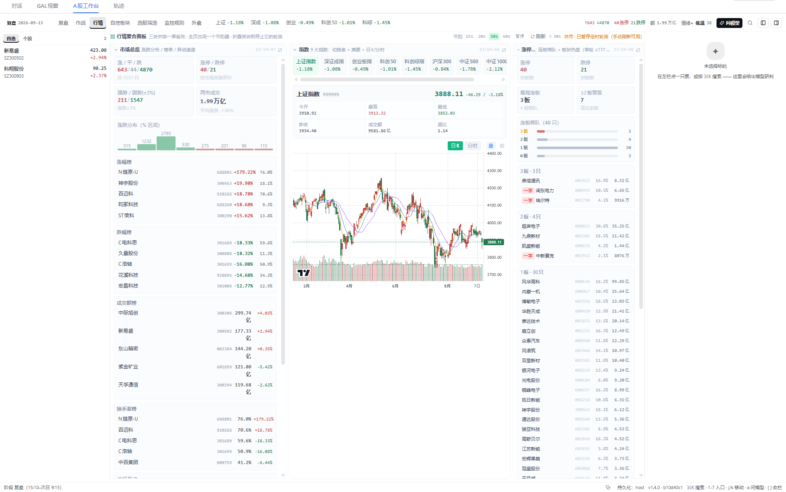
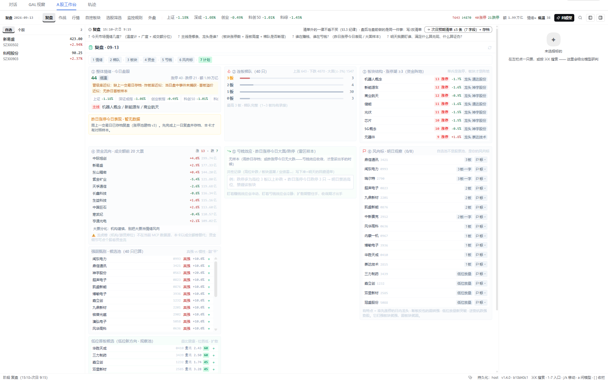
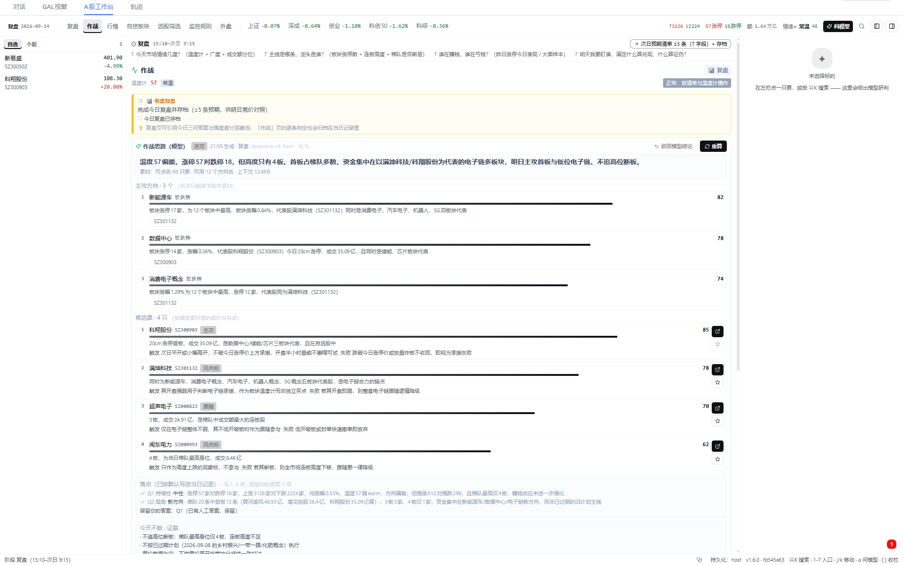
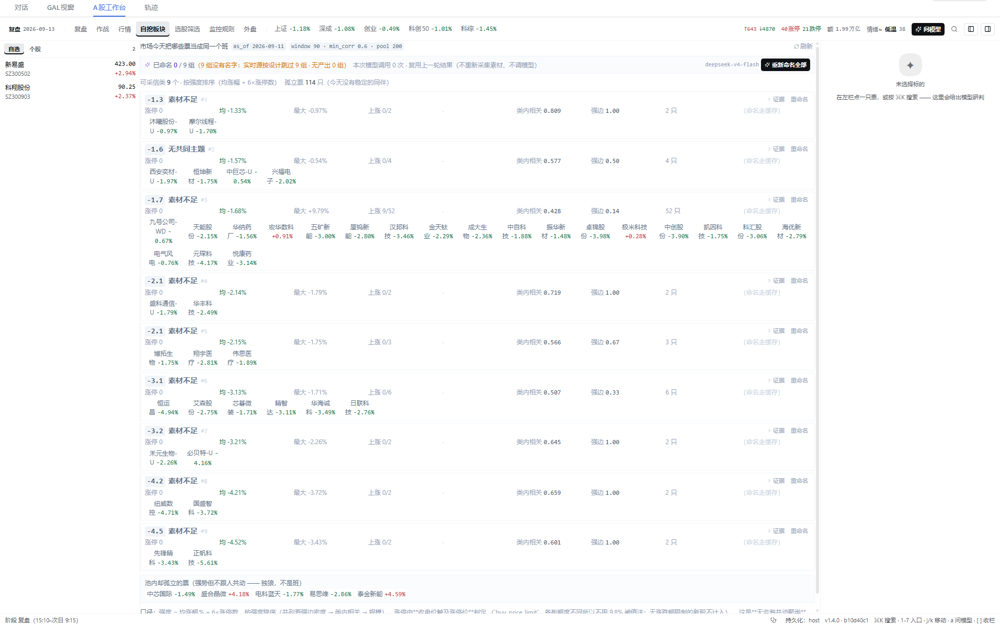
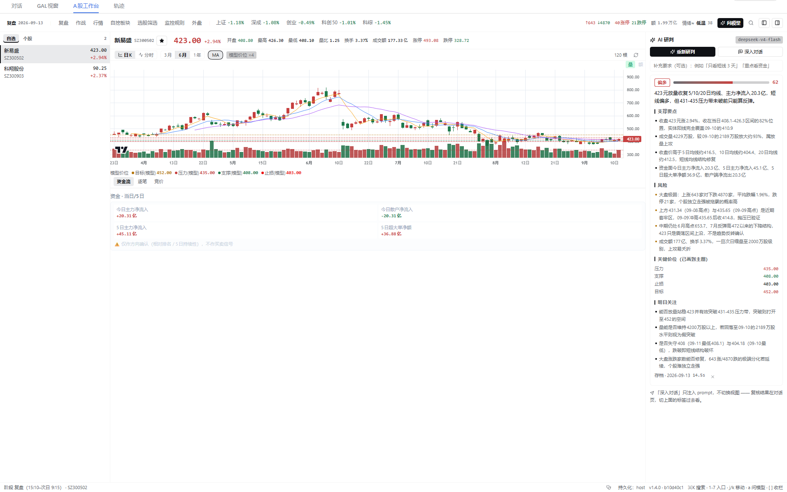

# A股工作台 · `@lisonevf/dsh-stock-panel`

> **把你的 AI 会话窗口，变成一块 A 股盯盘执行台。**
>
> 盘后复盘写清单 → 次日竞价对照 → 盘中只答三个问题 → 尾盘定仓。
> 界面按这套时间表组织，而不是让你在三十个标签页里找。

**一句话安装**（装完重启 `dsh web`，会话页就多一个「A股工作台」）：

```bash
dsh plugin --profile web add https://github.com/LisonEvf/dsh-stock-panel/releases/download/v1.6.0/lisonevf-dsh-stock-panel-1.6.0.tgz
```



---

## 它是什么

一个挂在 [dsh](https://www.npmjs.com/package/@deepseek-ai/dsh)（DeepSeek Harness）里的 **Web 插件**，占会话页「对话」右侧的整页视图槽位。

它**不是**又一个行情软件。同花顺、通达信能给你的数据，它一个都不多给。

它解决的是另一个问题：

> 盯盘的人真正缺的不是"更多数据"，而是**"在正确的时间，只回答正确的问题"**。

所以这个插件的每个页面都绑定在时间表上：盘后它能陪你走完七步复盘、输出一份次日预期清单并存档；次日竞价你能拿着清单逐条对照；盘中它只留三个问题；尾盘它帮你定仓。**页面会跟着时段自己切换**（手动点过导航就不再跟随）。

---

## 七个视图

| 视图 | 它干什么 |
|---|---|
| **行情**（默认入口） | 一屏仪表盘：环境带（涨跌家数 / 涨停跌停 / 强势弱势 / 最高连板 / ≥2板晋级 / 两市成交 + 涨跌分布横条）→ 指数（含图）│ 涨停梯队 → 榜单 │ 市场异动。**整页不滚动，各块内部滚动**；列数按容器实测宽度自动分档（1440px 三列档，780px 两列档） |
| **复盘** | 盘后七步流程，输出**次日预期清单**（≤5 条 / 7 字段）并存档 |
| **作战** | 第一屏就是模型读完盘面素材给的**作战思路**：主攻方向 → 候选票（含触发/失败条件）→ 三问落点 → 持仓动作 → 竞价判定。**你只做采纳 / 修改 / 驳回** |
| **自挖板块** | 无监督共动聚类 + 模型命名归类（下面单独讲，这是最有意思的一块） |
| **工作台** | 点左栏任意一行即到：报价头 + 日K⇄分时 + 资金 / 逐笔 / 竞价 + 右栏 AI |
| **选股筛选** | 快照条件筛选 + MA 信号 + AI 排序（AI 结果带 `AI#n` 徽标，只做参考） |
| **监控规则** | 你设规则，常驻 `AlertWatcher` 推 Toast 与徽标——不占主区，任何入口下都生效 |

| 复盘：七步流程 | 作战：模型给今天的作战思路 |
| --- | --- |
|  |  |

| 自挖板块：共动聚类 + 模型命名 | 工作台：个股（日K⇄分时 + 资金 / 逐笔 / 竞价） |
| --- | --- |
|  |  |

---

## 三个真正不一样的地方

### 一、自挖板块：让市场自己告诉你它把哪些票当成了一个板块

官方概念板块是**厂商预制的**，而且经常滞后——等你看到"某某概念"上榜，行情已经走完一半。

这个视图换了个思路：**不看标签，看钱**。

```
全 A 快照
  → 60 日残差收益（去市场均 + 可选 PCA）
  → Pearson 相关矩阵
  → 层次聚类切边
  → 过滤「弱链 / 传递链」伪类与孤立票
  → 批量交给模型命名归类（实测约 35s 出名字）
  → 与官方行业/概念做差异对照
```

结果里每一类都带**强度条**和**来源胶囊**（模型主题 / 官方行业 / 官方概念），点「证据」能看到它为什么这么分，不满意可以**重命名**。页头显示模型调用预算与缓存命中情况，底部**如实汇总被排除掉的弱链类、传递链类和孤立票**——不假装每个聚类都有意义。

> 这套算法不依赖行情软件的任何标签，所以它能看见官方分类看不见的东西。

### 二、AI 给的结论永远是只读的

「一键研判」会让模型读完盘面素材给一份决策卡（立场 / 把握分 / 支撑要点 / 风险），并**把关键价位画到主图上**，回填到复盘预期排序和选股 AI 排序里。

但是——

> **它永远不会替你写进清单。**
> 每一条都要你亲手点「+」才会进入你的清单；已经在清单里的条目标注出来，不重复插入。你自己的草稿**不被覆盖**。

这个设计是刻意的：模型可以帮你省时间，但**决策必须是你的**。顺带一提，这也让产品停在"数据统计工具"的位置上，而不是替你给结论。

### 三、密度是被当作一等公民管的

"整页不滚动、各块内部滚动"、"信息条字段改 auto-fit 等宽网格"、"状态带 38 → 44px"——这些都在 `ux-contract` 门禁里，**和密度、对比度一起进 CI**。改坏了构建就红。

---

## 我不做什么（很重要）

- ❌ **不荐股、不预测涨跌、不给买卖点、不展示胜率、不承诺收益。** 模型的输出只是参考素材，结论由你得出。
- ❌ **不是全功能量化平台。** 选股引擎、向量化回测、财务数据、数据管道不在这个插件里——它是**执行台**，不是研究工作台。
- ❌ **不发布行情数据。** 数据来自你自行配置的合法行情数据源，本插件只做展示与统计。
- ❌ **不内置 AI 荐股。** 模型怎么用、用不用，由你决定。

---

## 安装

前置：Node.js 18+ 与本机已装 `dsh`（`npm install -g @deepseek-ai/dsh`）。

| # | 命令 | 额外要做什么 |
|---|---|---|
| **① 推荐** | `dsh plugin --profile web add https://github.com/LisonEvf/dsh-stock-panel/releases/download/v1.6.0/lisonevf-dsh-stock-panel-1.6.0.tgz` | **什么都不用**。tarball 已含构建产物，不跑构建脚本 |
| **② 跟 main 走** | `dsh plugin --profile web add github:LisonEvf/dsh-stock-panel#main --config.dangerouslyAllowAllBuilds=true` | 不用改配置文件，但每次安装会**现场构建**（约 50s） |

装完**重启 `dsh web`**，然后**硬刷新浏览器**（Ctrl+Shift+R）。会话页出现「**A股工作台**」标签页。

不需要手工登记 settings、不需要跑脚本、**也不改动宿主任何文件**。

<details>
<summary>为什么第 ① 条真的是一条命令 / 想锁版本 / 构建脚本怎么放行（点开）</summary>

**① 为什么它是一条命令**：tarball 是**已构建产物**，pnpm 直接用、不执行任何构建脚本 → 既不需要凭证，也不需要 allowBuilds。dsh 认的是安装后的真实包名，所以 `dsh.profile.bundles` 照样自动加上。

真机验证（全新 `DSH_HOME` + 空 profile）：装到的 `lib/client.js` 与 Release 资产**逐字节一致**，`bundles` 变 `[dsh-base, @lisonevf/dsh-stock-panel]`，`dsh web` 起得来（host 半注册全部路由），浏览器里 `viewRegistered: true`、19 个内置工具、console 0 报错。

**想锁版本**：把 URL 里的版本号换掉即可（资产名固定为 `lisonevf-dsh-stock-panel-<版本>.tgz`）。

**② 关于 `dangerouslyAllowAllBuilds`**：`--config.<key>=<value>` 由 dsh 原样转发给 pnpm，于是"拦构建脚本"这道闸当场放行。代价：放行的是**该命令的全部**构建脚本；不想每次带 flag，就在 profile 的 `pnpm-workspace.yaml`（`$DSH_HOME/profiles/web/pnpm-workspace.yaml`）里写一次 `dangerouslyAllowAllBuilds: true`。

想**精确放行**也可以，但 key **精确到 commit**：`'@lisonevf/dsh-stock-panel@https://codeload.github.com/LisonEvf/dsh-stock-panel/tar.gz/<commit-sha>': true`——只写包名、`'@lisonevf/*'`、URL 通配**都不认**。

**⚠️ `#v1.6.0` 这个 tag 装不上**（它早于 `publish` 脚本改名：pnpm 的 prepare 会把 `publish` 当生命周期钩子一起跑 → 内部再发一次包而失败）。**git 安装请用 `#main`**（或任何 ≥ `25dc05d` 的提交）。

发布渠道只有 **GitHub Release 资产**一条，由 `pnpm release:asset` 生成。**不要去别处找包。**
</details>

完整配置、排障、字段口径见 [`USER-GUIDE.md`](USER-GUIDE.md) 与 [`MCP-SETUP.md`](MCP-SETUP.md)。

---

## 数据从哪来

插件通过 host 半进程内的数据桥接取数（19 个工具：报价 / K线 / 分时 / 逐笔 / 竞价 / 板块成分 / 资金流 / 异动 / 自挖板块……），输出做统一归一化。**数据端点由你自己配置**，插件不内置、不分发任何行情数据。

遇到连不上时：页面红条会明确说"行情源不可达"，不会静默显示空数据——**取数失败一律如实上抛，没有兜底回退**。排障见 [`MCP-SETUP.md`](MCP-SETUP.md) §3。

---

## 工程

- **双半架构**：host 半（Node 侧，注册路由 / 工具 / 持久化域 / AI 桥接）+ client 半（浏览器，`__ModuleLoader__` 加载的 esbuild 产物）
- **门禁**：`ux-contract` 26 条 + 密度 + 对比度 + 请求预算棘轮 + 客户端 bundle 契约 24 项断言——改坏了 CI 直接红
- **发布纪律**：tag → Release 资产 → sha256 → 一键安装命令；**同名资产默认拒绝覆盖**（已发布的就是用户装的那一份）
- **验收证据**：`acceptance/` 下有真机采集的截图脚本与逐条验收日志

### 口径台账（这些数字由 CI 从代码算出来比对，不是手写的）

| 口径 | 值 | 代码里的唯一真源 |
|---|---|---|
| 内置数据层工具 | **19 个工具**（行情 15 + 自挖概念 4） | `src/lib/tool-names.ts` |
| 注册给对话的工具 | **8 个对话工具**（行情 4 + 自挖概念 4） | 同上 |
| 持久化 | 12 张表 | `src/lib/state-tables.ts` |
| 客户端体积护栏 | 体积护栏（665KB） | `scripts/check-bundle-size.mjs` |
| 单测 | 单元测试（`node:test` + esbuild 打包，离线；30 文件） | `tests/*.test.ts` |
| 命名相关断言 | （93 条命名相关断言） | `tests/naming-*.test.ts` |

`tests/docs-consistency.test.ts` 会把上表逐个比对——**数字漂了会红，改了措辞也要同步它的正则**。

```bash
pnpm test                          # 单测（离线）
pnpm guard                         # ux-contract / 密度 / 对比度 / 请求预算
node scripts/smoke-embedded.mjs    # 19 个工具真机冒烟（需交易日行情）
```

---

## English

**A-share trading workstation as a dsh plugin.**

Turns your DeepSeek Harness session into an A-share intraday execution desk: market dashboard, post-close seven-step review, a model-generated battle plan, **self-mined sector clusters** (unsupervised co-movement clustering + LLM naming), per-stock workbench, screening, and alert rules.

Two design commitments worth noting:

1. **AI output is always read-only.** The model's verdict never writes into your list — you click `+` on each item. Your draft is never overwritten.
2. **No stock picks, no price predictions, no buy/sell signals, no win-rate claims.** It's a data and statistics tool; the conclusions are yours.

Install (then restart `dsh web` and hard-refresh):

```bash
dsh plugin --profile web add https://github.com/LisonEvf/dsh-stock-panel/releases/download/v1.6.0/lisonevf-dsh-stock-panel-1.6.0.tgz
```

---

## 免责声明

本项目是**数据统计与展示工具**，不构成任何投资建议，不提供证券投资咨询服务，不预测证券价格走势，不保证任何收益。所有分析结果仅供参考，使用者须自行独立判断并承担全部投资风险。数据来源由使用者自行配置并确保其合法性。本项目不对因使用本工具产生的任何直接或间接损失承担责任。

## License

MIT

---

<div align="center">

如果它对你有用，点个 ⭐ Star 是最实在的支持。

</div>
